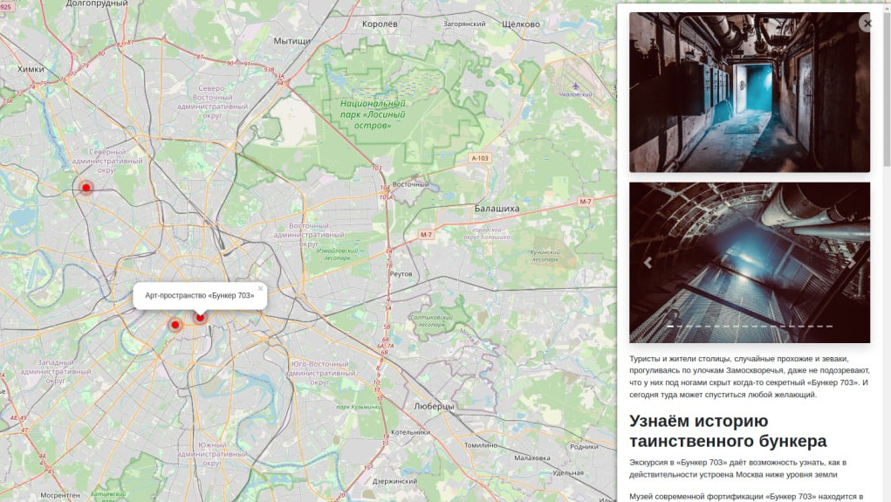

# Популярные места на карте

Фронтенд для будущего сайта о самых интересных местах в Москве.

### Демонстрация сайта


# Онлайн демка

Просмотреть демку сайта:
[Демка сайта](https://testewr23we1243.pythonanywhere.com/).

## Запуск

- Скачайте код
- Установите зависимости командой `pip install -r requirements.txt`
- Заполните переменные окружения(См ниже по статье)
- Запустите сервер командой `python3 manage.py runserver`

## Добавление новых мест.

- ### через консль

Для добавления популярных мест используйте админ панель или встроенные кастомные команды.
```python
python3 manage.py load_place [Ссылка на исходный код файла]
```

Исходный код файла в json формате:
```javascript
{
    "title": "Название",
    "imgs": [
        "Ссылка на картинку",
    ],
    "description_short": "Краткое описание",
    "description_long": "Полное описание",
    "coordinates": {
        "lat": 51.41,  # Координаты
        "lng": 37.37  # Координаты
    }
}
```

Для получения json файла воспользуйтесь интерфейсом GitHub: выберите файл, откройте его на отдельной странице и нажмите кнопку Raw. Так вы получите ссылку на исходный код файла.

- ### через админку

- Создать супер пользователся 
```
pyton3 manage.py createsuperuser
```
- Зайти в админку[Зайти в админку](https://testewr23we1243.pythonanywhere.com/admin).

Важно: сайт должен быть запущен

[Админ панель](http://127.0.0.1:8000/admin) 
- ```http://127.0.0.1:8000/admin```

- отредактировать данные в модели place

## Переменные окружения

Часть настроек проекта берётся из переменных окружения. Чтобы их определить, создайте файл `.env` рядом с `manage.py` и запишите туда данные в таком формате: `ПЕРЕМЕННАЯ=значение`.

Доступные переменные:
- `SECRET_KEY` — Секретный ключ проекта(Обязателен-2348()uj@*&@...)
- `DEBUG` — Дебаг-режим. Поставьте True, чтобы увидеть отладочную информацию в случае ошибки(Обязателен-True/False)
- `CSRF_COOKIE_SECURE` — Это мера безопасности для предотвращения атак заголовка HTTP-хоста(Обязателен-True/False)
- `SECURE_SSL_REDIRECT` — Редиректит все HTTP запросы на HTTPS(Обязателен-True/False)
- `SESSION_COOKIE_SECURE` — Позволит обеспечить пересылку данных cookies только через протокол HTTPS(Обязателен-True/False)
- `SECURE_HSTS_SECONDS` — Позволит обеспечить пересылку данных cookies только через протокол HTTPS(Обязателен-Кол-во секунд-True/False)
- `SECURE_HSTS_INCLUDE_SUBDOMAINS` — добавляется includeSubDomainsв заголовок HTTP Strict Transport Security если True(Обязателен-True/False)
- `ALLOWED_HOSTS` — Список хостов/доменов, для которых может работать текущий сайт(Опционально-[xxx.x.x.x])
- `STATIC_URL` — Хранит путь к каталогу со статическими файлами(Опционально-/folder_name/)
- `MEDIA_URL` — Хранит путь к каталогу к медиа файлами(Опционально-/folder_name/)

## Настройки

Внизу справа на странице можно включить отладочный режим логгирования.


Настройки сохраняются в Local Storage браузера и не пропадают после обновления страницы. Чтобы сбросить настройки, удалите ключи из Local Storage с помощью Chrome Dev Tools —&gt; Вкладка Application —&gt; Local Storage.

Если что-то работает не так, как ожидалось, то начните с включения отладочного режима логгирования.

<a href="#" id="data-sources"></a>


## Используемые библиотеки

* [Leaflet](https://leafletjs.com/) — отрисовка карты
* [loglevel](https://www.npmjs.com/package/loglevel) для логгирования
* [Bootstrap](https://getbootstrap.com/) — CSS библиотека
* [Vue.js](https://ru.vuejs.org/) — реактивные шаблоны на фронтенде

## Цели проекта

Код написан в учебных целях
